<a id="top"></a>

<p align="center">
  <picture>
    <source media="(prefers-color-scheme: dark)" srcset="docs/media/banner-dark.svg">
    <source media="(prefers-color-scheme: light)" srcset="docs/media/banner-light.svg">
    
  </picture>
</p>

<p align="center">
  
  
  
  <a href="LICENSE"></a>
  <a href="https://github.com/DevL0rd/RVC-Voice-Changer/stargazers"></a>
</p>

<h3 align="center">Sound like anyone, in every app.</h3>

<p align="center">
  RVC Voice Changer turns your microphone into any voice model you like, live, right from your Plasma panel.<br>
  Discord, OBS and your games just hear one microphone, and it keeps working whether the effect is on or off.
</p>

<p align="center">
  <a href="#get-started"><b>Get started</b></a> ·
  <a href="#see-it-work"><b>See it work</b></a> ·
  <a href="#how-it-flows"><b>How the sound flows</b></a> ·
  <a href="#widget"><b>The widget</b></a> ·
  <a href="#voices"><b>Add voices</b></a> ·
  <a href="#faq"><b>FAQ</b></a> ·
  <a href="#more"><b>More projects</b></a>
</p>

<p align="center">
  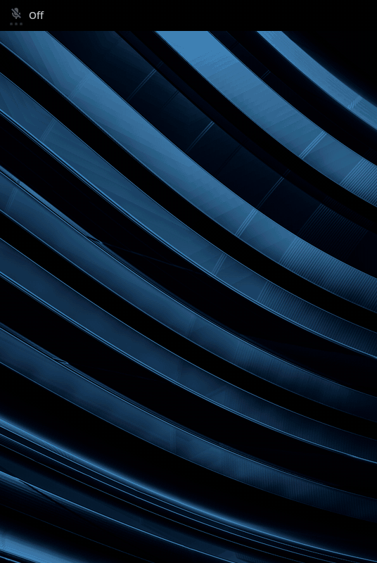
</p>

---

<a id="get-started"></a>

## 🚀 Get started

```sh
git clone --recursive https://github.com/DevL0rd/RVC-Voice-Changer.git
cd RVC-Voice-Changer
./install.sh
```

That's it. The installer adds any system packages you're missing, builds a private Python runtime, picks the right PyTorch for your NVIDIA or AMD graphics card (or your CPU), downloads the pitch and speech models RVC needs, installs the widget and starts the background service. It only asks for `sudo` to add missing packages and to hook into system updates.

> [!TIP]
> Add **RVC Voice Changer** to your panel from **Add Widgets**, drop a voice into [`models/`](#voices), then pick **RVC Virtual Microphone** as the input device in Discord, OBS or your game.

<table>
  <tr>
    <td>🔄 <b>Update</b></td>
    <td>The voice changer updates itself with every system update and tells you when it's done. When an update brings a new Python, it rebuilds its runtime for it. On Fedora Atomic desktops and SteamOS that happens at your next login after an update. You can also run <code>git pull &amp;&amp; ./install.sh</code> any time. It's safe to repeat and keeps your voices and settings.</td>
  </tr>
  <tr>
    <td>📦 <b>From a package</b></td>
    <td>Package builds run <code>./install.sh --aur</code> (or set <code>RVC_AUR=true</code>), so your package manager handles updates instead.</td>
  </tr>
  <tr>
    <td>🎮 <b>Pick a GPU runtime</b></td>
    <td>The installer finds your graphics card on its own. To choose, set <code>RVC_TORCH_BACKEND</code> to <code>cuda</code>, <code>rocm</code> or <code>cpu</code>, or point <code>RVC_TORCH_INDEX_URL</code> at your own PyTorch wheels.</td>
  </tr>
  <tr>
    <td>🧹 <b>Remove</b></td>
    <td>Run <code>./uninstall.sh</code>. It removes the service, the widget, the virtual microphone, its shortcuts, the private Python runtime and the update hook, and keeps your voices and settings.</td>
  </tr>
  <tr>
    <td>🖥️ <b>Needs</b></td>
    <td>KDE Plasma 6, PipeWire with WirePlumber and PipeWire-Pulse, and Python 3.11 or newer. An NVIDIA (CUDA) or AMD (ROCm) GPU makes it fast; a CPU works too.</td>
  </tr>
  <tr>
    <td>🧊 <b>Atomic desktops</b></td>
    <td>On Fedora Atomic desktops like Kinoite, Aurora and Bazzite, and on SteamOS in Desktop Mode, everything installs to your home folder, so the read-only system stays untouched. If the system image is missing something, the installer tells you exactly what to add.</td>
  </tr>
  <tr>
    <td>🐧 <b>Distros</b></td>
    <td>The installer sets everything up on Arch and Arch-based systems like CachyOS, Fedora, openSUSE Tumbleweed, Debian testing, Fedora Atomic desktops like Kinoite, Aurora and Bazzite, and SteamOS.</td>
  </tr>
</table>

---

<a id="see-it-work"></a>

## 🎬 See it work

### 🎭 Pick a voice, hear it right away

<table>
  <tr>
    <td width="44%" valign="top">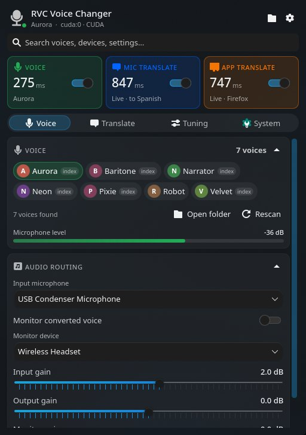</td>
    <td valign="top">
      <br>
      Every voice in your <code>models/</code> folder shows up as a chip. Tap one and the voice changer switches to it on the spot. Voices that come with a retrieval index get a small <b>index</b> badge.
      <br><br>
      Flip the <b>Voice</b> switch at the top to start converting, or middle-click the panel button. The tile shows your live latency, and the microphone meter shows what it's hearing.
      <br><br>
      Choose your microphone, listen to yourself on a pair of headphones, and set input, output and monitor gain right underneath.
    </td>
  </tr>
</table>

### 🎙️ One microphone for every app

The voice changer creates a single **RVC Virtual Microphone** and keeps it there. When the voice is on, apps hear the converted voice. When it's off, your real microphone passes straight through the same device. Discord never loses its mic, your game never needs a new input, and you never re-pick anything.

### 🌍 Speak another language

<table>
  <tr>
    <td valign="top">
      <br>
      Turn on <b>Mic translate</b> and Gemini Live Translate speaks what you say in another language, in more than 70 languages, straight into the virtual microphone. It works on your converted voice or on your plain voice.
      <br><br>
      Keep a little of your <b>original voice</b> underneath so people hear you right away while the translation catches up, or set it to 0% for translated speech only.
      <br><br>
      <b>App translate</b> goes the other way. Pick an app that's playing sound, like a call, a stream or a video, and hear its speech translated on the headphones or speakers you choose, while the app keeps playing as usual. Both directions can run at once.
    </td>
    <td width="44%" valign="top">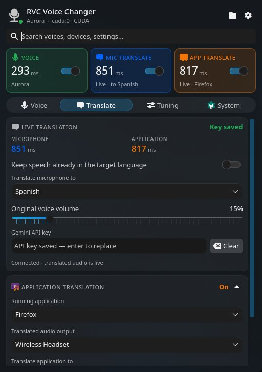</td>
  </tr>
</table>

### 📈 Watch every millisecond

<table>
  <tr>
    <td width="50%" valign="top">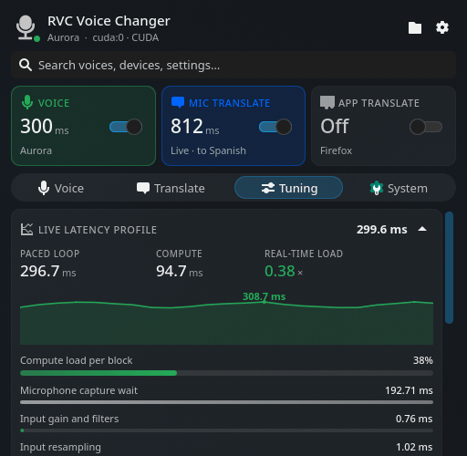</td>
    <td valign="top">
      <br>
      The <b>Live latency profile</b> breaks every block of audio into its steps: capture, pitch extraction, ContentVec features, index retrieval, the RVC generator, cleanup and output. It marks the slowest one for you.
      <br><br>
      A running graph and the <b>real-time load</b> tell you at a glance whether your machine keeps up. Under 1× means there's headroom to spare.
      <br><br>
      Trade responsiveness for smoothness with <b>block size</b>, <b>crossfade</b> and <b>extra context</b>, and watch the numbers move as you do.
    </td>
  </tr>
</table>

### ✨ And the little things

<table>
  <tr>
    <td width="33%" valign="top">
      <h4>🎚️ Tune the voice</h4>
      Pitch in semitones, pitch detector (RMVPE, FCPE, CREPE), index rate, consonant protection, loudness mix, autotune, and automatic pitch targeting to match the model's range.
    </td>
    <td width="33%" valign="top">
      <h4>🧹 Clean it up</h4>
      Voice activity detection, noise suppression, a noise gate and high- and low-pass filters keep fans, hum and breaths out of the voice.
    </td>
    <td width="33%" valign="top">
      <h4>⚡ GPU or CPU</h4>
      Auto uses your NVIDIA or AMD GPU and falls back to CPU. Switch to CPU while a game needs the GPU, then back again.
    </td>
  </tr>
  <tr>
    <td valign="top">
      <h4>⌨️ Global shortcuts</h4>
      Toggle the voice, mic translation and app translation from anywhere. <kbd>Alt</kbd> + <kbd>T</kbd> toggles mic translation out of the box.
    </td>
    <td valign="top">
      <h4>🔎 Search everything</h4>
      Type a voice, a device or a setting like <i>pitch</i> or <i>noise</i> and only the matching controls stay on screen.
    </td>
    <td valign="top">
      <h4>💡 Every setting explains itself</h4>
      Hover any control for what it does, when to change it and what goes wrong if you push it too far.
    </td>
  </tr>
  <tr>
    <td valign="top">
      <h4>💾 Saves as you go</h4>
      Every change applies instantly and is still there next time. One button resets everything to defaults.
    </td>
    <td valign="top">
      <h4>📜 Rolling logs</h4>
      The last events from the service sit right in the widget, ready to copy when something needs a closer look.
    </td>
    <td valign="top">
      <h4>🪶 Light on your system</h4>
      While the voice is off, the service runs no models and PipeWire passes your microphone straight through.
    </td>
  </tr>
</table>

<p align="right"><a href="#top">back to top ⬆</a></p>

---

<a id="how-it-flows"></a>

## 🔀 How the sound flows

<p align="center">
  <picture>
    <source media="(prefers-color-scheme: dark)" srcset="docs/media/audio-path-dark.svg">
    <source media="(prefers-color-scheme: light)" srcset="docs/media/audio-path-light.svg">
    
  </picture>
</p>

<table>
  <tr>
    <td>🎤 <b>Voice on</b></td>
    <td>Your microphone goes through the RVC voice model on your GPU or CPU, then through live translation if it's on, and lands in <b>RVC Virtual Microphone</b>. A monitor copy can go to your headphones.</td>
  </tr>
  <tr>
    <td>🔁 <b>Voice off</b></td>
    <td>PipeWire links your microphone straight into the same virtual microphone. No models run, and apps keep the same input.</td>
  </tr>
  <tr>
    <td>🌐 <b>App translation</b></td>
    <td>A copy of one app's sound is translated and played on the output you pick. The app's own sound keeps going where it always went.</td>
  </tr>
</table>

---

<a id="widget"></a>

## 🧩 The widget

<table>
  <tr>
    <td width="36%" valign="middle" align="center">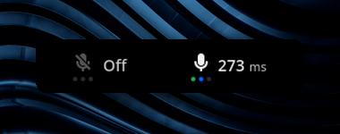</td>
    <td valign="middle">
      The panel button is a microphone that lights up while your voice is changing. Turn on its live latency readout and three small lights for the voice, mic translation and app translation in the widget's settings, along with the tab it opens on. Click it to open the dashboard, or middle-click to switch the voice on and off.
    </td>
  </tr>
</table>

<table>
  <tr>
    <td width="33%"><p align="center"><b>Voice</b> — voices, microphone level and audio routing</p></td>
    <td width="33%"><p align="center"><b>Translate</b> — your microphone and any app, in the language you pick</p></td>
    <td width="33%">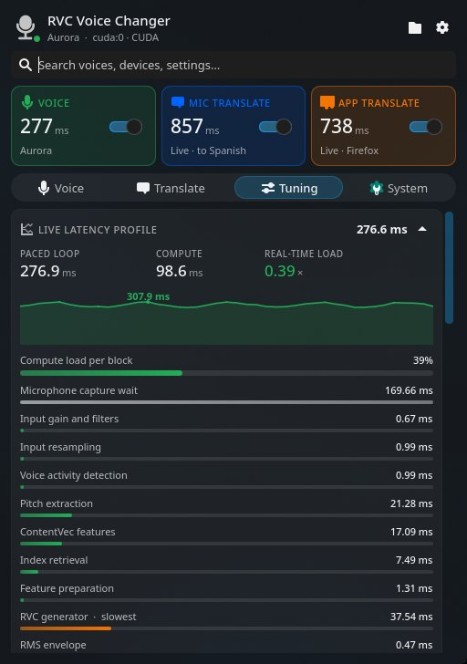<p align="center"><b>Tuning</b> — the live latency profile, stage by stage</p></td>
  </tr>
  <tr>
    <td>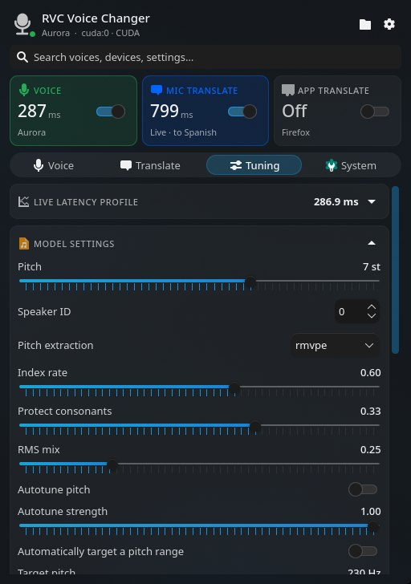<p align="center"><b>Model settings</b> — pitch, detector, index, protection and autotune</p></td>
    <td>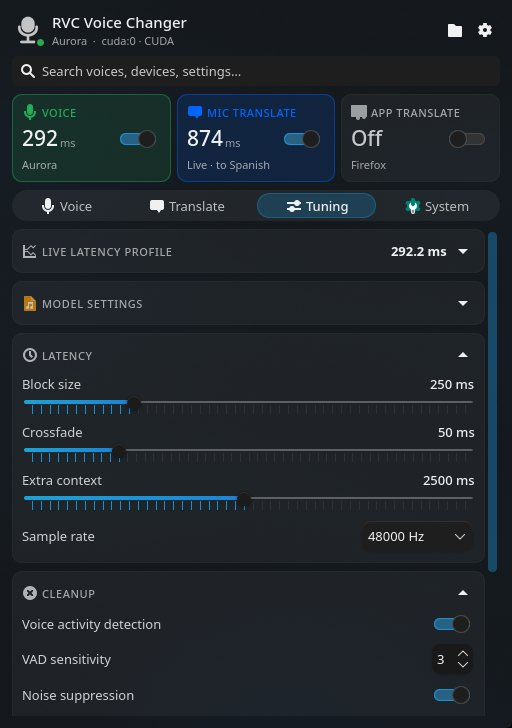<p align="center"><b>Latency &amp; cleanup</b> — block size, crossfade, sample rate and noise control</p></td>
    <td>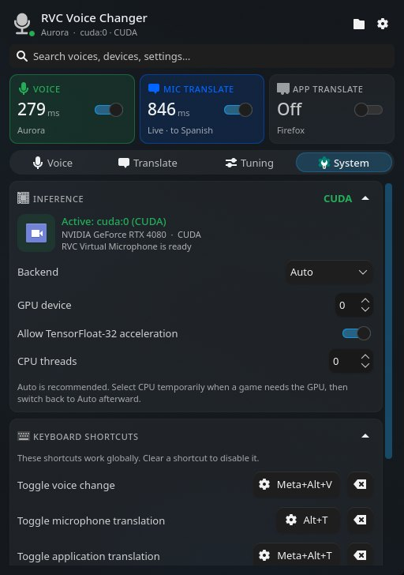<p align="center"><b>System</b> — inference device and global shortcuts</p></td>
  </tr>
  <tr>
    <td>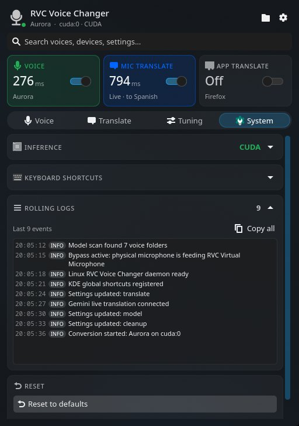<p align="center"><b>Rolling logs</b> — recent events, copy with one click</p></td>
    <td>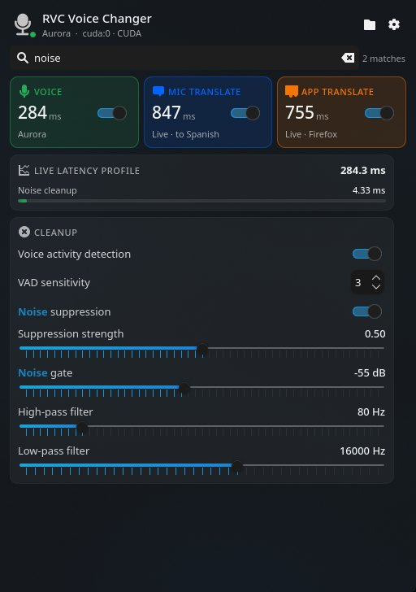<p align="center"><b>Search</b> — only the settings you're looking for</p></td>
    <td valign="middle">
      <b>Keys</b>
      <br><br>
      <kbd>Alt</kbd> + <kbd>T</kbd> toggles mic translation.
      <br><br>
      Give the voice and app translation their own keys under <b>System → Keyboard shortcuts</b>. Clear a shortcut to turn it off.
    </td>
  </tr>
</table>

<p align="right"><a href="#top">back to top ⬆</a></p>

---

<a id="voices"></a>

## 🗣️ Add voices

Put each voice in its own folder inside `models/`:

```text
models/
├── Aurora/
│   ├── aurora.pth
│   └── added_IVF.index
└── Narrator/
    └── narrator.pth
```

Each folder needs one `.pth` model. A matching `.index` file is optional and usually makes the voice sound closer to the original. Use **Open folder** in the widget to jump there, then **Rescan** after adding or removing voices. Your voices stay on your machine and out of Git.

---

<a id="command-line"></a>

## ⌨️ Command line

| Command | What it does |
| :-- | :-- |
| `rvc-voice-changer-ctl status` | Print the current voice, devices, settings and live stats |
| `rvc-voice-changer-ctl on` | Switch the voice on |
| `rvc-voice-changer-ctl off` | Switch the voice off |
| `rvc-voice-changer-ctl select "Aurora"` | Pick a voice by its folder name |
| `rvc-voice-changer-ctl rescan` | Look for new or removed voices |

Settings live in `~/.config/Linux-RVC-Voice-Changer/config.json`. Service logs: `journalctl --user -u linux-rvc-voice-changer.service -f`.

---

<a id="faq"></a>

## 💬 Questions

<details>
<summary><b>Discord doesn't list the virtual microphone. Where is it?</b></summary>
<br>
Pick <b>RVC Virtual Microphone</b> as the input device in Discord's voice settings. Plasma files software microphones under virtual devices, so to see it in the Audio Volume tray applet, turn on <b>Show virtual devices</b>.
</details>

<details>
<summary><b>What do people hear when the voice is off?</b></summary>
<br>
Your normal microphone, through the same RVC Virtual Microphone. You can leave every app pointed at it all the time.
</details>

<details>
<summary><b>How fast is it?</b></summary>
<br>
It depends on your hardware and the block size. The panel button and the latency profile show the real number while you talk. Smaller blocks respond faster and work the GPU harder; if you hear crackles, raise the block size or the extra context.
</details>

<details>
<summary><b>Does translation need the internet?</b></summary>
<br>
Yes. Translation uses Google's Gemini Live Translate preview, so it needs a Gemini API key and a connection, and it adds some network delay. Voice conversion on its own runs entirely on your machine.
</details>

<details>
<summary><b>Is my Gemini API key safe?</b></summary>
<br>
It's stored only in your local settings file, readable by your user alone, and the service never sends it back to the widget.
</details>

<details>
<summary><b>A game needs my whole GPU. Can I move the voice off it?</b></summary>
<br>
Yes. Set <b>System → Backend</b> to <b>CPU</b> while you play, then back to <b>Auto</b>. A larger block size helps the CPU keep up.
</details>

---

<a id="more"></a>

## 🧰 More from DevL0rd

Other Plasma projects made to sit on the same desktop. Click a banner to open it on GitHub.

<p align="center">
  <a href="https://github.com/DevL0rd/Konveyor">
    <picture>
      <source media="(prefers-color-scheme: dark)" srcset="docs/media/more/konveyor-dark.svg">
      <source media="(prefers-color-scheme: light)" srcset="docs/media/more/konveyor-light.svg">
      
    </picture>
  </a>
  <br>
  <a href="https://github.com/DevL0rd/Konveyor"><b>Konveyor</b></a> · Your windows, on a conveyor belt.
</p>

<p align="center">
  <a href="https://github.com/DevL0rd/KBoard">
    <picture>
      <source media="(prefers-color-scheme: dark)" srcset="docs/media/more/kboard-dark.svg">
      <source media="(prefers-color-scheme: light)" srcset="docs/media/more/kboard-light.svg">
      
    </picture>
  </a>
  <br>
  <a href="https://github.com/DevL0rd/KBoard"><b>KBoard</b></a> · Type, glide and talk, right on your desktop.
</p>

<p align="center">
  <a href="https://github.com/DevL0rd/Android-Daemon">
    <picture>
      <source media="(prefers-color-scheme: dark)" srcset="docs/media/more/android-daemon-dark.svg">
      <source media="(prefers-color-scheme: light)" srcset="docs/media/more/android-daemon-light.svg">
      
    </picture>
  </a>
  <br>
  <a href="https://github.com/DevL0rd/Android-Daemon"><b>Android-Daemon</b></a> · Your phone, right on your desktop.
</p>

<p align="center">
  <a href="https://github.com/DevL0rd/Syncthing-Monitor">
    <picture>
      <source media="(prefers-color-scheme: dark)" srcset="docs/media/more/syncthing-monitor-dark.svg">
      <source media="(prefers-color-scheme: light)" srcset="docs/media/more/syncthing-monitor-light.svg">
      
    </picture>
  </a>
  <br>
  <a href="https://github.com/DevL0rd/Syncthing-Monitor"><b>Syncthing Monitor</b></a> · Your sync, at a glance.
</p>

---

<p align="center">
  Released under the <a href="LICENSE">MIT License</a>. See <a href="THIRD_PARTY_NOTICES.md">THIRD_PARTY_NOTICES.md</a> for the projects it builds on.
</p>

<p align="center"><a href="#top">back to top ⬆</a></p>
